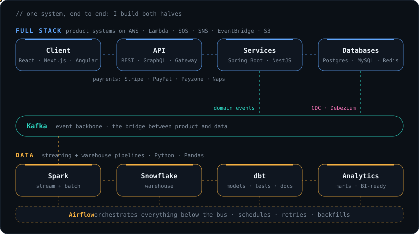
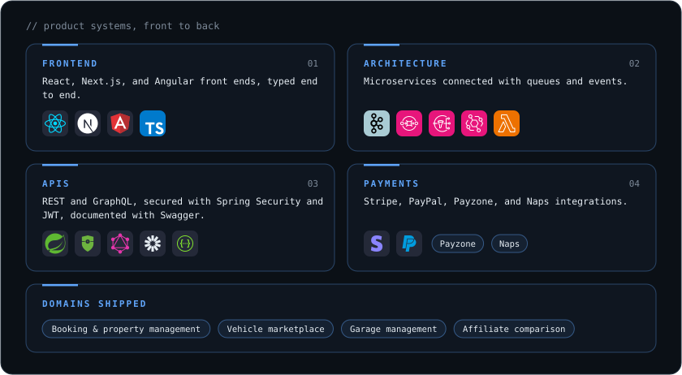
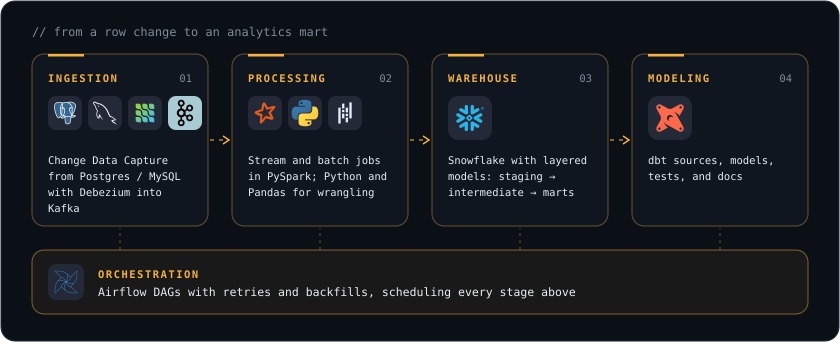
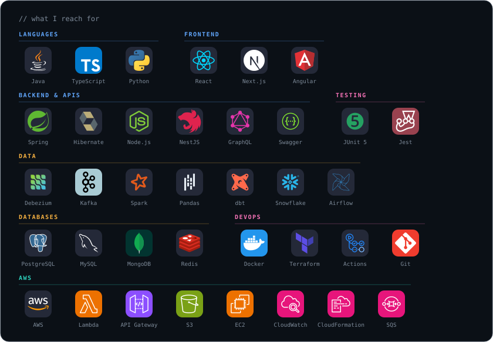

  

  <a href="https://www.linkedin.com/in/omar-az"><b>LinkedIn</b></a>
  &nbsp;·&nbsp;
  <a href="mailto:omar_azhari@outlook.com"><b>Email</b></a>
  &nbsp;·&nbsp;
  <a href="https://github.com/AZOMARDEV?tab=repositories"><b>Repositories</b></a>

 

I'm a **Full Stack Engineer** and a **Data Engineer**. I build the product end to end, then build the pipelines that turn its data into something useful.

**Full stack:** React / Next.js and Angular front ends on top of Java / Spring Boot and NestJS microservices that talk through Kafka, SQS/SNS, and EventBridge on AWS.

**Data:** I capture changes with Debezium, stream them through Kafka, process them with Spark, and model them in Snowflake with dbt, all orchestrated by Airflow.

I've been shipping production code since 2021 and hold a Master's in Big Data & Cloud Computing.

 

  

 

### `01` &nbsp;Full stack engineering

  

### `02` &nbsp;Data engineering

  

### `03` &nbsp;Where I've shipped

- **Jabadoor**: short-term rental SaaS. Full Stack Engineer, joined as an intern.
- **MisterVoiture**: used-vehicle marketplace. Full Stack Engineer, part-time.
- **Onedustry Technologies**: internship.
- **EVOSER IT Consulting**: internship.

 

### `04` &nbsp;Toolbox

  

 

### `05` &nbsp;GitHub analytics

  

  
  

  
  

  

 

  Casablanca, Morocco · <a href="mailto:omar_azhari@outlook.com">omar_azhari@outlook.com</a>

